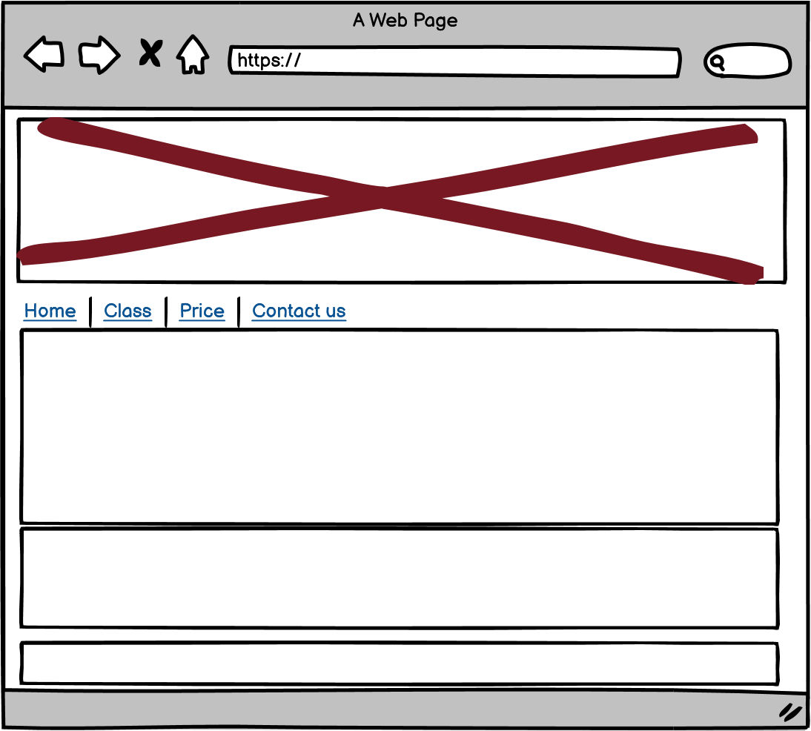

# Get Fit Gym
## UI
### Project Goals

This project is a website to showcase a gym's facilities and classes, providing essential information for current and potential memebers. 

### Customer Goals

1. Access information they need for daily use of the gym, including classes and timetables. 
2. Obtain essential details such as location, opening hours, and contact information.
3. View the environment and facilities of the gym
4. Learn the latest offerings

### Business Goals

1. Retain existing members by supporting them with up-to-date class schedules and easy access to gym information.
2. Attracting more new members to sign in with detailed, appealing, and inspiring design.

### User Stories

__Membership Registration__
- **As a** potential member
- **I want to** sign up for a gym membership online
- **So that** I can start using the gym facilities without visiting in person

__Accessing Class Schedules__
- **As a** current or potential gym member
- **I want to** view the weekly class schedule on the gym’s website
- **So that** I can decide which classes to attend

__Viewing Gym Facilities__
- **As a** potential member
- **I want to** see photos and videos of the gym facilities
- **So that** I can evaluate if the gym meets my needs before joining

__Finding Contact Information__
- **As a** gym member or potential member
- **I want to** find the gym's contact information and location easily
- **So that** I can get in touch or visit the gym without difficulty

__Membership Tier Information__
- **As a** potential member
- **I want to** compare the benefits of different membership tiers
- **So that** I can choose the one that best fits my needs

### Design Choices

__Layout__
- **Choice**: The layout is designed with a clean and intuitive structure, including four sections, Gym tour, Timetalbe, Membership and Find us.
- **Reason**: A straightforward layout helps users easily navigate the website and find information quickly. The layout uses a grid system to ensure responsiveness on different devices.

__Color__
- **Choice**: A palette of [blue and white] was used for the site’s colors.
- **Reason**: The chosen colors align with the gym’s branding and create a vibrant, energetic atmosphere that motivates users to engage with the content.

__Fond Choice__

- **Choice**: Arial. 

- **Reason**: 
1. **Readability**: Arial's straightforward design enhances readability and ensures that the text is compatible with different devices and screen sizes.
2. **Familiarity**: Arial is a familiar font for many users, creating a comfortable reading experience.

### Wireframe

The following wireframes outline the layout and structure of the gym website on web,smartphone and ipad:

   
## Features

- **Class Schedule**: A dynamic schedule of all gym classes, allowing members to see available classes and book their spots online.

- **Membership Registration**: An easy-to-use registration form that allows new members to sign up for a gym membership directly on the website.

- **Gym video**: A vibrant way showcasing the gym facilities and members enjoying their workouts, motivating potential members to join.

- **Responsive Design**: The website is fully responsive, providing a seamless experience on desktops, tablets, and mobile devices.

- **Contact Information**: A dedicated section with the gym's location, opening hours, and multiple ways to get in touch, including a contact form and links to social media profiles.

- **Google Maps Integration**: An embedded Google Map showing the exact location of the gym, making it easy for users to find directions.

## Techonology Used
- **HTML**: To structure the content of the website.
- **CSS**: For styling and making the website visually appealing.
- **Javascript**: To insert content from Google Map and Youtube.

## Accessibility

Our website is designed with accessibility in mind to ensure that it is usable by as many people as possible, including those with disabilities. The following accessibility features have been implemented:

- **Color Contrast**: Using color contrast in the text and background to make it visually accessible.
- **Alt Text for Images**: All images include descriptive alt text to ensure they are accessible to users with visual impairments.
- **Responsive Design**: The website is responsive and adapts to different screen sizes, making it usable on both desktop and mobile devices.

## Preview
Here are screenshots of the final website:

## Testing
### Join Us Form Testing

__Test Form Submission__
- **Steps:** 
  1. Open the "Join Us" page.
  2. Fill out the form with valid details.
  3. Click "Submit."
- **Expected Result:** 
  - You should see a confirmation message.

__Test Validation__
- **Steps:** 
  1. Open the "Join Us" page.
  2. Leave some required fields empty.
  3. Try submitting the form.
- **Expected Result:** 
  - Error messages should appear for missing fields.

__Test Responsiveness__
- **Steps:** 
  1. Open the "Join Us" page on different devices (e.g., phone, tablet, desktop).
- **Expected Result:** 
  - The form should be easy to use on all devices.

__Report Issues__
- **Contact:** Email [wendytanvalencia@gmail.com].

###  Navigation Bar Testing

__Check Links__
- **Steps:** Click each link in the navigation bar.
- **Expected:** Links should navigate to the correct pages or sections.

__Check Visibility__
- **Steps:** View the site on different devices and screen sizes.
- **Expected:** All links should be visible and accessible.

__Check Sticky Behavior__
- **Steps:** Scroll down the page.
- **Expected:** The navigation bar should stay at the top if it’s meant to be sticky.

__Check Responsiveness__
- **Steps:** Resize the browser window.
- **Expected:** The navigation bar should adjust to fit different screen sizes.

__Report Issues__
- **Contact:** Email [wendytanvalencia@gmail.com].

## Bugs

- **Issue:** Images not loading correctly on the home page.
  - **Cause:** Incorrect file path in the HTML code.
  - **Solution:** Updated the file paths to the correct directory.
- **Issue:** Items on the top going so much on the right that some letters disappearing 
  - **Solution:** Reducing the padding of the top bar.
- **Issue:** About Us in the navigation bar can not be linked to the About Us page.
  - **Cause:** About Us page doesn't have a header and ID.
  - **Solution:** Add header and ID to About Us page.

## Version Control
This project uses Git for version control. 
- - **Repository**: The project is maintained in a Git repository, which helps track changes and manage the project’s history.
- - **Commits**: Changes are committed with descriptive messages to keep track of modifications and updates.
- - **Commit Messages**: Descriptive commit messages are used to explain the purpose of each change.
- - **Main Branch**: The `main` branch represents the latest stable version of the project. All final changes are merged into this branch.
  
## Deployment

This project is deployed using [GitHub Pages](https://pages.github.com/).

  
## Attribution

### Images
- Image of gym members: [gympeople](assets/gympeople.jpg) via [keypersonofinfluence](https://www.keypersonofinfluence.com/wp-content/uploads/2015/05/entrevo-keypersonofinfluence-exercises-in-the-gym.jpg).
- Image of gym logo:[logo](assets/logo.png) via[github](https://nricha.github.io/projects/get-fit/)

### Videos
- Gym tour video:  via [YouTube]((https://www.youtube.com/watch?v=OP0EP7ry7hk)).

### Top bar
The design and functionality of the top bar followed [Create a Simple Navigation Bar Using HTML and CSS | Website Header Design Using HTML and CSS](https://www.youtube.com/watch?v=B7blgp2XZic), which gave gave detailed and valuable instructions.

### Timetable
The design and functionality of the timetable section were influenced by [OURGYM](https://ourgym.co.uk/classes-timetable/), which provided valuable insights into user experience and interface design.

